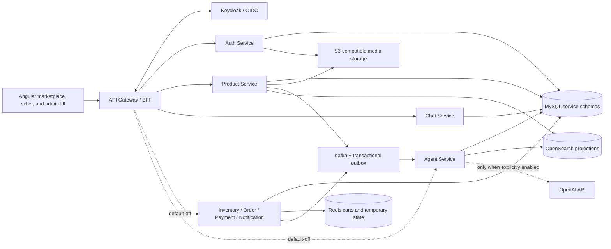

# MSB Commerce

[](LICENSE)
[](pom.xml)
[](pom.xml)
[](frontend/package.json)
[](agent-service/pyproject.toml)
[](https://github.com/tiancaiq/JianShang-e-commerce/actions/workflows/pull-request-quality.yml)
[](docker-compose.yml)
[](docker-compose.yml)
[](infra/keycloak/)
[](docs/mvp/database.md)
[](docs/v2/commerce/v2-cart-01-redis-cart-plan.md)
[](agent-service/README.md)

## Overview

MSB Commerce is a full-stack marketplace and commerce platform built to explore how a system can support two different transaction models without conflating them: peer-to-peer listings, where buyers and individual sellers arrange payment and delivery themselves, and business-store commerce, where the platform owns cart, inventory, checkout, payment, and order workflows.

The repository is an engineering portfolio project. It demonstrates service boundaries, identity and tenant isolation, transactional data modeling, asynchronous workflows, secure media handling, and a guarded AI-agent architecture across a Java/Spring backend, Angular frontend, and Python/FastAPI agent service. The marketplace, seller, chat, bounded V2 commerce, and complete administrator-operations platform are implemented. The admin platform and local/demo commerce lifecycle have passed their release-candidate gates; external provider rollout and AI capabilities remain explicitly gated.

The authoritative product and technical contracts live in [`docs/mvp`](docs/mvp/), with V2 commerce plans in [`docs/v2/commerce`](docs/v2/commerce/).

## Why I Built This

Many marketplace examples stop at CRUD screens and a single database. I built MSB Commerce to practice the harder engineering decisions behind a production-style system: deciding which service owns each rule, keeping identity and authorization consistent across boundaries, recovering safely from partial failures, evolving schemas without rewriting history, and introducing AI without allowing it to bypass application controls.

The project is deliberately broader than an online catalog. It is a working environment for learning distributed-system design while preserving one important product distinction: individual listings create peer-to-peer trades, while business listings can enter platform-owned commerce workflows.

## Project at a Glance

| Dimension | Repository evidence |
| --- | --- |
| **Architecture** | 8 domain services plus an API Gateway/BFF |
| **User surfaces** | Public marketplace, seller/account experience, and admin portal |
| **Application stack** | Java/Spring Boot, Angular/TypeScript, Python/FastAPI |
| **Data and messaging** | MySQL, Redis, OpenSearch, Kafka, Flyway, transactional outbox |
| **Identity and security** | Keycloak OIDC, Spring Security, CSRF, tenant isolation, service authentication |
| **AI engineering** | RAG, LangChain ReAct tools, citations, deterministic evaluation, default-off release gates |
| **Delivery and quality** | Docker Compose, GitHub Actions, Testcontainers, browser and architecture tests |

### Current Release Status

| Capability | Status |
| --- | --- |
| Marketplace MVP | Implemented and verified |
| Admin operations platform | Release-candidate audit passed; 17 modules complete with no open P0/P1 defects |
| Bounded V2 local/demo commerce | Release-candidate gate passed |
| AI agent capabilities | Source-complete and default-off pending rollout evidence |
| External commerce integrations | Deferred until provider and operational decisions are approved |

## Architecture



The browser communicates through one BFF boundary. Each service owns its schema; services do not read or write another service's database. Synchronous APIs handle immediate validation and commands, while Kafka and transactional outboxes carry durable asynchronous work. Redis and OpenSearch are projections or temporary stores, never authorities for orders, payments, or audit history.

## Live Demo & Project Links

- **Live marketplace:** [demo.bigjianshang.shop](https://demo.bigjianshang.shop)
- **Architecture:** [MVP architecture](docs/mvp/architecture.md)
- **API contracts:** [MVP API contract](docs/mvp/api-contract.md)
- **Delivery plan:** [Development roadmap](docs/mvp/development-roadmap.md)

The live site is a curated demo deployment. It may trail the repository, and default-off capabilities are not guaranteed to be active there.

## Screenshot


Additional authenticated seller, admin, commerce, and AI-assistant screenshots are planned; the live deployment may not expose every repository capability.

## Highlights

- **Bounded microservices:** Auth, Product, Chat, Inventory, Order, Notification, Payment, and Agent domains own their APIs and persistence. Shared modules contain technical primitives rather than business entities or repositories.
- **Authentication and authorization:** Keycloak provides OpenID Connect identity; Spring Security enforces backend authorization; the gateway acts as a session-based BFF and strips spoofed identity headers. Business operations also verify membership and granular permissions.
- **API Gateway / BFF:** Spring Cloud Gateway provides the browser-facing boundary, token relay, CSRF protection for commands, correlation IDs, route-level feature gates, and consistent error handling.
- **Transactional design:** MySQL schemas use forward-only Flyway migrations, optimistic locking, immutable history, idempotency records, transactional outboxes, and consumer deduplication where workflows cross service boundaries.
- **Event-driven integration:** Kafka contracts and transactional outbox patterns decouple durable domain changes from downstream processing while keeping authoritative state in the owning service.
- **Media storage:** A small `common-storage` adapter supports S3-compatible object storage. Product-owned rules validate listing media and avatars without leaking storage keys through public contracts.
- **Admin operations:** The permission-scoped admin portal covers dashboard insights, users, business applications, businesses, listing moderation, reports, investigation cases, appeals, orders, disputes, payments, refunds, support, catalog governance, system operations, governance approvals, and analytics. Sensitive commands use previews, optimistic concurrency, idempotency, immutable audit evidence, and least-privilege controls.
- **AI agent architecture:** The isolated FastAPI service includes OpenAI provider adapters, OpenSearch RAG, LangChain-based ReAct discovery, strict allowlisted tools, actor-scoped persistence, citations, seller handoff, prompt-injection defenses, and deterministic offline release gates. AI actions remain default-off and cannot bypass application authorization or human confirmation.
- **Testing depth:** The repository contains Java unit and integration tests, Testcontainers-backed MySQL/Redis/OpenSearch coverage, authorization and tenant-isolation tests, migration tests, Angular component/service tests, Playwright browser tests, Python unit/integration tests, and architecture guardrails.
- **CI/CD and containers:** GitHub Actions validate backend, frontend, Agent, migrations, secrets, dependencies, and feature-specific release gates. Docker Compose models local infrastructure, full-stack containers, demo profiles, and optional AI dependencies.
- **Security-focused failure behavior:** Protected resources use non-enumerating responses, internal calls use bounded service authentication, webhook signatures are verified, logs redact secrets and unnecessary PII, and incomplete capabilities fail closed.

## Tech Stack

| Area | Technologies |
| --- | --- |
| Backend | Java 21, Spring Boot 3.4.2, Spring Cloud 2024.0.0, Spring MVC, Spring Security, Maven; Python 3.12, FastAPI, Pydantic |
| Frontend | Angular 20, TypeScript 5.8, RxJS, Angular SSR, responsive CSS and theme tokens |
| Database | MySQL 8, Flyway, Redis, OpenSearch; PostgreSQL for Keycloak |
| Infrastructure | Apache Kafka, Schema Registry, S3-compatible object storage, Keycloak, Mailpit, Docker Compose, Elasticsearch/Logstash/Kibana development tooling |
| Authentication | OAuth 2.0 / OpenID Connect, Keycloak, Spring Security resource servers, gateway BFF sessions and CSRF protection |
| AI | OpenAI Responses API adapter, LangChain, ReAct tool orchestration, OpenSearch vector retrieval, deterministic offline evaluation |
| Testing | JUnit 5, Spring Boot Test, Mockito, Testcontainers, ArchUnit, Python `unittest`, Jasmine/Karma, ChromeHeadless, Playwright |
| DevOps | Maven Wrapper, npm, Dockerfiles and Compose profiles, GitHub Actions, dependency review, secret scanning, migration and architecture checks |

## Features

Feature status is intentionally explicit: source-complete does not mean enabled in the default runtime.

### Admin operations platform

The completed admin surface contains 17 top-level modules: Dashboard, Users, Business Applications, Businesses, Listing Moderation, Reports, Cases, Appeals, Orders, Disputes, Payments, Refunds, Support, Catalog, System, Governance, and Analytics.

Authorization is enforced in the owning backend services rather than only in navigation. Read-only roles do not receive mutation controls, sensitive actions use dry-run or approval gates, PII is permission-scoped, and concurrent/idempotent commands are covered by MySQL integration tests. The final exploratory audit passed with zero open P0/P1 or observed P2 defects.

Verification evidence includes:

- Angular: **751/751**.
- Finance Playwright: **6/6**.
- Catalog, System, Governance, and Analytics Playwright: **18/18**.
- Appeals: **6/6**; reports and investigations: **7/7**; enforcement workflows: **10/10**.
- Isolated concurrency/idempotency tests: **55/55**.
- Payment Service after the final same-key refund concurrency fix: **68/68**, including **19/19** Payment Intent MySQL integration tests.

See the [admin platform release-candidate plan](docs/mvp/adm/admin-platform-rc-01a.md) and [final exploratory audit](docs/qa/admin-platform-exploratory-audit-2026-08-24.md) for the full module matrix, safeguards, evidence, and defect ledger.

### Completed

- OIDC login/session handling, account profile and address workflows.
- Public listing browse, search and detail pages with approved-field privacy boundaries.
- Individual seller profiles plus versioned listing and media creation/edit flows.
- Business onboarding, store profiles and business listing management.
- Participant-authorized listing chat.
- The full admin operations platform described above, including fine-grained roles, cross-service governance, safe financial operations, operational diagnostics, participant privacy boundaries, and normalized audit timelines.
- Bounded local/demo business commerce covering Redis cart, inventory reservation, checkout, fake-provider payment, orders, fulfillment, cancellation compensation, returns, refunds, and durable in-app notifications. The `V2-COM-RC-01` release-candidate gate is green.
- Responsive Angular surfaces for marketplace, account, seller, and admin jobs.
- Shared correlation/error handling, storage adapters, test utilities and architecture checks.

### Default-off / rollout-gated

- **Business commerce:** the bounded lifecycle is release-candidate verified for local/demo use. Production activation still requires real payment, carrier, payout, dispute, reconciliation, and operational rollout decisions.
- **Notifications:** durable in-app persistence, authenticated reads, gateway routing, event coverage, and account UI are implemented. External delivery transports and operational preferences remain deferred.
- **AI customer service and discovery:** authenticated sessions, hybrid RAG, citations, ReAct discovery, comparison and clarification behavior, history, and Angular chat surfaces are implemented behind capability and kill-switch gates. Offline evaluation is deterministic; production quality, latency, cost and rollout evidence are still blocking activation.
- **AI listing proposals:** image-to-listing proposals and seller-confirmed field application are implemented behind default-off gates; the seller remains the final authority and Product Service performs the versioned write.

### Planned

- Production payment-provider onboarding, capture, transfers, payouts, refunds, disputes and reconciliation.
- Production carrier integration, partial-return handling, and operational compensation/reconciliation tooling.
- Notification delivery transports, preferences, and retention policies.
- Production AI evaluation, policy approval, controlled rollout, cost/latency monitoring and rollback evidence.
- Removal of legacy infrastructure paths after all active services and local tooling no longer depend on them.

See the [MVP roadmap](docs/mvp/development-roadmap.md) and [V2 commerce plan](docs/v2/commerce/v2-com-00-commerce-domain-plan.md) for the detailed dependency order and release gates.

## Architecture Details

| Component | Port | Responsibility | Authoritative state |
| --- | ---: | --- | --- |
| Frontend | 4200 | Marketplace, account, seller, and admin Angular surfaces | None |
| API Gateway | 9000 | BFF sessions, routing, CSRF, token relay, feature gates | Session state |
| Auth Service | 8085 | Application users, profiles, addresses, business membership and permissions | MySQL `identity`; credentials remain in Keycloak |
| Product Service | 8091 | Stores, listings, media, public catalog projections, moderation | MySQL `catalog` |
| Chat Service | 8092 | Listing conversations and participant-authorized messaging | MySQL `chat` |
| Order Service | 8081 | Redis cart, checkout snapshots, order orchestration and order views | MySQL `order_service`; Redis for temporary cart state |
| Inventory Service | 8082 | Business stock and reservation lifecycle | MySQL `inventory_service` |
| Notification Service | 8083 | Durable in-app notification projection and reads | MySQL `notification_service` |
| Payment Service | 8084 | Provider-neutral intent, verified webhook and outbox foundations | MySQL `payment_service` |
| Agent Service | 8086 | RAG, customer assistance, discovery, proposal workflows and evaluation | MySQL `agent`; OpenSearch is derived |

## Repository Structure

| Path | Purpose |
| --- | --- |
| `api-gateway/` | Spring Cloud Gateway BFF, browser sessions, routing and feature boundaries |
| `auth-service/` | Application identity, profiles, addresses, business membership and permissions |
| `product-service/` | Catalog, stores, listings, media, public projections and moderation |
| `chat-service/` | Listing conversations and messages |
| `inventory-service/` | Business inventory and reservations |
| `order-service/` | Cart, checkout, order orchestration and buyer/business order views |
| `payment-service/` | Provider-neutral payment, verified webhook, refund, and outbox foundations |
| `notification-service/` | Default-off durable in-app notification projection and API |
| `agent-service/` | FastAPI AI runtime, RAG ingestion/retrieval, agents, persistence and evaluations |
| `frontend/` | Angular marketplace, account, seller and admin interfaces plus browser tests |
| `common-*` | Small Java technical libraries for core values, web conventions, storage and testing |
| `docs/mvp/` | Authoritative MVP requirements, architecture, data, API and roadmap contracts |
| `docs/v2/` | Commerce and later-phase design/implementation contracts |
| `infra/` | Keycloak realm and supporting infrastructure configuration |
| `tools/` | Architecture, CI and repository validation scripts |
| `.github/workflows/` | Pull-request, feature-release and demo-deployment workflows |

## Getting Started

### Prerequisites

- Java 21
- Node.js 22 and npm
- Python 3.12 for the optional Agent Service
- Docker Desktop or Docker Engine with Compose
- Git Bash, WSL or another Bash environment for `run.sh`

### 1. Clone and configure local defaults

```powershell
git clone https://github.com/tiancaiq/JianShang-e-commerce.git
Set-Location JianShang-e-commerce
docker compose config --quiet
```

`.env.example` documents the expected local variables. `run.sh` reads `.env` and then an optional, ignored `.env.local` override. Keep real credentials out of repository-tracked files and use environment-specific secret injection for any internet-facing deployment.

### 2. Start the application

The repository provides two Bash modes:

```bash
# Infrastructure in Docker; Java services and Angular run as local processes
./run.sh local

# Infrastructure and application services in Docker
./run.sh docker
```

Open <http://localhost:4200>. Stop either mode with:

```bash
./run.sh stop
```

To start only shared infrastructure for focused service development:

```powershell
docker compose up -d
```

### 3. Run the verification suites

Backend reactor:

```powershell
./mvnw.cmd test
```

Frontend:

```powershell
Set-Location frontend
npm ci
npm run build
npm test -- --watch=false --browsers=ChromeHeadless
```

Browser acceptance (after starting the required local/demo stack):

```powershell
Set-Location frontend
npx playwright test --project=chromium
```

Agent Service:

```powershell
python -m venv .venv
.\.venv\Scripts\Activate.ps1
python -m pip install -e ".\agent-service[dev]"
python -m unittest discover -s agent-service/tests -v
```

The Agent process can start without an API key for health checks, but readiness and provider-backed features remain unavailable until their explicit dependencies and gates are configured. See the [Agent Service guide](agent-service/README.md) for optional MySQL/OpenSearch integration tests and the isolated AI Compose profile.

## Engineering Decisions

- **Keep individual trades separate from business orders.** Peer-to-peer listings carry an explicit off-platform transaction notice; platform-owned payment and fulfillment belong only to business commerce.
- **Make ownership visible in architecture.** Each service owns its schema and business rules. Cross-service validation uses APIs; durable propagation uses versioned events and outboxes.
- **Treat derived systems as disposable.** MySQL remains authoritative; Redis holds temporary cart state and OpenSearch holds rebuildable search/RAG projections.
- **Put identity at the boundary, authorization in the service.** The BFF manages browser sessions and token relay, but each backend repeats actor, ownership and tenant checks.
- **Design retries before activation.** Money, inventory, checkout, order, webhook and notification paths use explicit idempotency, optimistic concurrency and immutable history rather than relying on best-effort requests.
- **Fail incomplete features closed.** Independent backend, gateway and frontend flags prevent unfinished V2/V3 paths from creating UI dead ends or accidental external calls.
- **Constrain AI like any other untrusted integration.** Agents use allowlisted tools with strict schemas and the requesting actor's permissions. Retrieved text and media are untrusted, sensitive output is filtered, and writes require explicit human confirmation.

## Interesting Engineering Challenges

- **Distributed consistency needs domain-specific recovery.** Transactional outboxes, replay-safe consumers and immutable histories are more useful than attempting cross-service database transactions, but every boundary still needs explicit timeout, duplicate and partial-failure behavior.
- **Authorization is a data-model concern.** Hiding navigation is insufficient; non-enumerating reads, business membership, granular permissions and cross-user tests must exist at repositories and service boundaries.
- **Applied migrations are permanent contracts.** As the project moved beyond tutorial-era data paths, changes were added through forward-only Flyway migrations and compatibility tests instead of rewriting migration history.
- **AI quality is not implied by a successful model call.** Grounding, citations, source-version checks, tool authorization, injection resistance, offline evaluation and rollout gates are separate engineering concerns.
- **Feature flags require end-to-end verification.** A disabled feature should perform no repository, downstream API or provider work—not merely hide its Angular route.

## Future Improvements

- Select and integrate production payment, carrier, payout, dispute, and reconciliation providers after ownership and compliance decisions are approved.
- Extend the verified bounded commerce lifecycle with partial returns and production-grade operational recovery tooling.
- Add notification delivery transports and operational preferences without weakening durable in-app delivery.
- Extend production operational evidence and recovery exercises while retaining the current permission, ownership, concurrency, and audit boundaries.
- Collect controlled production evidence for AI answer quality, privacy, latency and cost before enabling a cohort.
- Simplify local orchestration and retire legacy database/tooling paths once no verified workflow depends on them.

## License

This project is available under the [MIT License](LICENSE).
