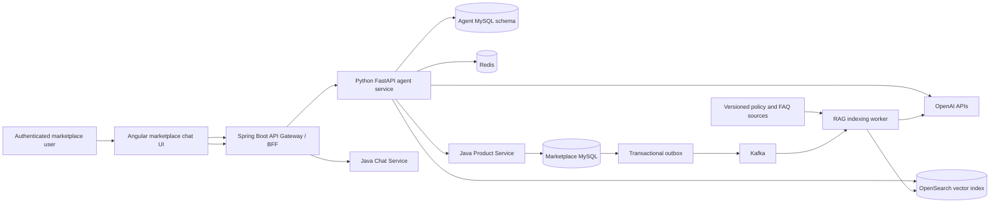
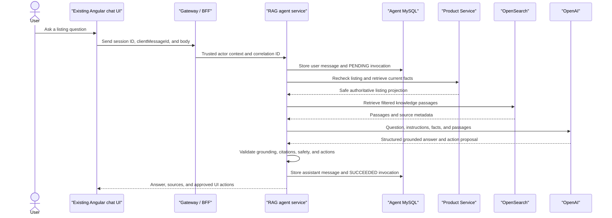

# General AI Agent Implementation Roadmap

Status: approved coordination and handoff plan.

Release: V3.

## Purpose

This document gives future implementation tasks one shared view of the AI
architecture, technology direction, slice order, safety boundaries, and
handoff expectations.

This Codex task is the general AI planning task. Application code should be
implemented in separate tasks, one roadmap slice at a time.

## How Future Tasks Must Use This Document

Before implementing an AI slice:

1. Read `AGENTS.md`.
2. Read the approved top-level MVP requirements, architecture, database, API
   contract, and development roadmap.
3. Read this document and the detailed AI slice documents.
4. Inspect the current implementation and uncommitted changes.
5. Select exactly one slice.
6. Reconcile contract ambiguity before writing application code.
7. Preserve unrelated worktree changes.

`AI-RAG-00` reconciles the later approved hybrid-RAG direction with the
original `AI-CS-01` planning document and the top-level MVP contracts:

- The listing customer-service assistant is a listing-bound hybrid RAG agent.
- OpenSearch is the planned derived vector index.
- Authoritative changing listing facts still come from Product Service.
- LangChain is introduced after the first measurable RAG customer-service
  path, not before it.

The reconciled contract is defined in
`docs/mvp/ai/ai-rag-00-hybrid-rag-contract-reconciliation.md`. Future tasks
must preserve its source ownership, precedence, metadata, visibility,
citation/action, staleness/deletion, migration, retention, and privacy rules.

## Current State

Completed:

- `AI-00` general agent and automated-operations planning.
- `AI-CS-01` original customer-service planning baseline.
- `AI-RAG-00` hybrid-RAG contract reconciliation.
- `AI-LLM-01` isolated OpenAI provider foundation.
- `AI-RAG-01` OpenSearch vector foundation.
- `AI-RAG-02A` through `AI-RAG-02D` listing publication, durable intake,
  indexing, rebuild, invalidation, and promotion operations.
- `AI-RAG-03` listing-only filtered retriever.
- `AI-KNOW-01` Product Service category-guidance owner implementation.
- `AI-RAG-02E-CATEGORY` Agent Service category-guidance adapter.
- `AI-CS-01A` Agent Service persistence foundation.
- `AI-CS-01B` authenticated Agent Service APIs.
- Existing Angular `Marketplace agent` placeholders in the floating chat and
  `/account/messages` UI.
- Existing BFF authentication and correlation handling.
- Existing Product Service public listing projection and listing eligibility
  behavior.
- `AI-LIST-01A` default-off seller image-to-listing proposal contract and
  offline fake orchestration.
- `AI-LIST-01B` offline multimodal provider adapter binding over the existing
  typed Responses abstraction.
- `AI-LIST-01C` Product-authorized owned-draft listing media adapter and
  completed AI-LIST boundary cleanup.
- `AI-LIST-02` approved seller proposal review and confirmed-application plan.

Pending:

- Policy, safety, and FAQ owner contracts and adapters.
- Customer-service production evidence and approved cohort activation; source
  orchestration, gateway/UI integration, and offline release gates are
  complete but remain default-off.
- `AI-LIST-02A/B/C` authenticated proposal API, seller review UI, and
  confirmed versioned Product application.
- Optional LangChain integration through a separate dependency decision.
- Report classification and automated operations.

No future task should commit an API key or place it in source code, shared
constants, tests, logs, documentation examples, or migrations.

## Approved Product Direction

### Customer-service agent

The first customer-service agent:

- is authenticated-only;
- is bound to one active, approved individual listing;
- reuses the existing marketplace chat presentation;
- stores its sessions and messages outside buyer/seller chat;
- retrieves current structured listing facts from Product Service;
- retrieves approved unstructured knowledge from a vector index;
- identifies missing or conflicting information;
- cites or identifies the sources used for policy and knowledge answers;
- offers a user-initiated `Message seller` handoff when seller knowledge is
  required;
- never sends a buyer/seller message automatically.

The assistant cannot negotiate, accept a deal, promise availability, verify
payment, reserve an item, create a trade, modify a listing, publish content, or
impersonate the seller.

### Seller image-to-listing agent

The seller agent:

- operates only on seller-owned eligible drafts and authorized media;
- returns a strict proposal for title, description, category candidates,
  attributes, alt text, uncertainties, and warnings;
- does not assert brand, model, authenticity, safety, condition, or
  completeness when evidence is insufficient;
- cannot save, submit, approve, or publish a listing;
- requires explicit seller review and use of the existing versioned listing
  update API.

### Report classification and automated operations

The report workflow classifies whether evidence substantiates an enumerated
marketplace-policy violation. It does not decide whether conduct is legal.

The model returns a structured assessment only. A deterministic Java policy
evaluator owns any operational decision and may choose only from an approved
allowlist.

Initial classification remains shadow-only. Any operation that changes listing
visibility without per-case staff confirmation requires explicit approval,
feature flags, false-positive gates, audit history, reversibility, and an
immediate kill switch.

The model never receives a free-form enforcement tool.

## Target Architecture



OpenAI does not receive database credentials and does not call application
services directly. It requests allowlisted tools; the agent service validates
and executes those tools using trusted runtime context.

## Technology Direction

| Area | Approved direction |
| --- | --- |
| Marketplace UI | Angular and the existing chat presentation |
| Gateway and security | Java 21, Spring Boot, BFF sessions, Keycloak/OIDC |
| Agent runtime | Python 3.12 and FastAPI |
| Model generation | OpenAI Responses API |
| Initial orchestration | OpenAI Agents SDK |
| Later orchestration | LangChain and, when justified, LangGraph |
| Input/output validation | Pydantic strict schemas |
| Embeddings | OpenAI Embeddings API through a replaceable adapter |
| Vector index | OpenSearch |
| Authoritative application data | MySQL through owning Java services |
| Agent persistence | MySQL owned by agent service |
| Temporary state and rate limits | Redis |
| Durable indexing changes | Kafka through transactional outbox |
| Internal Python HTTP | HTTPX |
| Observability | Structured logs, metrics, traces, correlation IDs |
| CI | GitHub Actions with mocked provider tests |
| Initial deployment | Docker and Docker Compose-compatible runtime |

Do not introduce Pinecone, Weaviate, PostgreSQL/pgvector, MongoDB, or another
vector database without an approved architecture decision. OpenSearch is a
derived index and never becomes authoritative for listing status, price,
availability, policy versions, reports, operations, or audit history.

## Hybrid RAG Rules

The customer-service agent uses two retrieval paths.

### Structured application retrieval

`getListing` returns current authoritative fields:

- listing status and moderation eligibility;
- seller type;
- price and currency;
- negotiability;
- quantity;
- condition;
- public city and region;
- payment and delivery preferences;
- approved transaction notice.

Changing listing facts must not be answered from vector content alone.

### Vector knowledge retrieval

`retrieveKnowledge` returns approved passages from:

- eligible listing descriptions and public attributes;
- marketplace FAQs;
- payment and delivery safety guidance;
- versioned marketplace policies;
- category-specific buying guidance.

Every indexed chunk must include metadata sufficient to enforce:

- source type and source ID;
- source version and content hash;
- listing ID when listing-specific;
- public or permission-scoped visibility;
- effective policy dates;
- supported language;
- indexing and invalidation timestamps.

If Product Service and retrieved vector content conflict, Product Service
wins. The answer must identify uncertainty rather than merge incompatible
facts.

Conversation history remains in agent-service MySQL tables. It is not placed
in the shared vector index for the initial release.

## Runtime Question Flow



The first synchronous implementation stores the user message and a `PENDING`
invocation before external calls. It stores the assistant message and marks
the invocation `SUCCEEDED` in a later transaction. Failures mark the invocation
`FAILED` without creating a duplicate assistant message.

`clientMessageId` deduplicates retries.

## Proposed Slice Order

### 1. AI-LLM-01 OpenAI provider foundation

Status: implemented; replacement runtime credential verified with a live
synthetic embedding check on 2026-07-19.

Do not expand this slice into product behavior.

### 2. AI-RAG-00 knowledge and contract reconciliation

Status: complete as a documentation-only contract slice.

Reference:

- `docs/mvp/ai/ai-rag-00-hybrid-rag-contract-reconciliation.md`

Completed outcomes:

- update requirements, architecture, database, API contract, roadmap, AI-00,
  and AI-CS-01 for hybrid RAG;
- define supported source types and ownership;
- define source precedence;
- define chunk metadata and visibility;
- define citation and answer-action contracts;
- define `getListing` and `retrieveKnowledge` boundaries;
- define stale-source and deletion behavior;
- decide the agent schema migration mechanism;
- define data retention and privacy rules;
- add no RAG implementation.

The completed slice changed documentation only and made no dependency,
migration, runtime code, environment, or provider configuration change.

### 3. AI-RAG-01 OpenSearch vector foundation

Status: implemented and verified on 2026-07-18.

Reference:

- `docs/mvp/ai/ai-rag-01-opensearch-vector-foundation-plan.md`

Implemented outcomes:

- versioned vector index and alias strategy;
- embedding dimensions and configuration validation;
- strict metadata mappings and filters;
- indexing, update, invalidation, and deletion operations;
- no customer-facing agent endpoint;
- integration tests using OpenSearch;
- health, latency, error, and index-lag metrics.

### 4. AI-RAG-02 ingestion and embedding pipeline

Status: implementation plan complete. `AI-RAG-02A` was implemented and
verified on 2026-07-18. `AI-RAG-02B` was implemented and verified on
2026-07-19. `AI-RAG-02C` was implemented and verified on 2026-07-19;
the full local backlog was activated successfully. `AI-RAG-02D` is
implemented and locally deployed. `AI-RAG-02E-CATEGORY` is implemented,
verified, and locally deployed with category flags disabled; the remaining
`AI-RAG-02E` sources are deferred pending their authoritative owners.

Reference:

- `docs/mvp/ai/ai-rag-02-ingestion-embedding-pipeline-plan.md`
- `docs/mvp/ai/ai-rag-02a-product-listing-source-publication.md`
- `docs/mvp/ai/ai-rag-02b-agent-durable-ingestion-intake.md`
- `docs/mvp/ai/ai-rag-02c-listing-embedding-indexing.md`
- `docs/mvp/ai/ai-rag-02d-rebuild-deletion-and-promotion.md`

Required outcomes:

- authoritative source adapters;
- content sanitization and deterministic chunking;
- embedding adapter;
- outbox/Kafka-driven listing updates;
- versioned policy and FAQ ingestion;
- idempotent event handling;
- reindex and recovery command;
- deletion and tombstone handling;
- prompt-injection test fixtures.

Implement one ordered sub-slice at a time:

1. `AI-RAG-02A` Product listing source versions, internal export, and outbox.
   - Status: implemented and verified on 2026-07-18.
2. `AI-RAG-02B` agent durable Kafka intake and source client.
   - Status: implemented and verified on 2026-07-19.
3. `AI-RAG-02C` listing sanitization, OpenAI embeddings, and indexing.
   - Status: implemented, activated, and verified against the full local
     listing backlog on 2026-07-19.
4. `AI-RAG-02D` rebuild, tombstones, dual-generation updates, and promotion.
   - Status: implemented and locally deployed on 2026-07-19.
5. `AI-RAG-02E` policy, safety, FAQ, and category sources after their owners
   expose approved versioned contracts.
   - Status: `AI-RAG-02E-CATEGORY` implemented, verified, and locally deployed
     on 2026-07-19 with category flags disabled; policy, safety, and FAQ remain
     deferred because their owners do not exist.
   - Category reference:
     `docs/mvp/ai/ai-rag-02e-category-guidance-adapter-plan.md`

### 5. AI-RAG-03 knowledge retriever

Status: listing-only implementation verified on 2026-07-19.

Reference:

- `docs/mvp/ai/ai-rag-03-listing-knowledge-retriever.md`

Required outcomes:

- replaceable `KnowledgeRetriever` interface;
- strict actor, listing, visibility, language, source, and policy-date filters;
- top-k limits and bounded context size;
- source metadata returned with passages;
- empty, stale, conflicting, and unavailable-result behavior;
- retrieval relevance and cross-listing isolation tests.

### 6. AI-KNOW-01 category-guidance owner

Status: implemented, verified, and deployed locally on 2026-07-19.

Reference:

- `docs/mvp/ai/ai-know-01-category-guidance-owner-plan.md`

Required outcomes:

- Product Service immutable category/language source versions;
- platform-admin publish and retire commands with optimistic locking;
- newer invalidation tombstones instead of history rewrites;
- exact-version and watermark-stable Agent Service reads;
- transactional reference-only outbox events;
- category-deactivation invalidation;
- minimum admin authoring UI;
- no AI-generated or AI-approved authoritative guidance.

The dependent `AI-RAG-02E-CATEGORY` Agent Service adapter is implemented and
locally deployed. `CATEGORY_GUIDANCE` retrieval remains disabled until the
controlled rollout and reconciliation steps are explicitly approved:

- `docs/mvp/ai/ai-rag-02e-category-guidance-adapter-plan.md`

### 7. AI-CS-01A agent persistence

Status: implemented, verified, migrated locally, and deployed on 2026-07-19
with `AGENT_PERSISTENCE_ENABLED=false`.

Required outcomes:

- `agent_sessions`;
- `agent_messages`;
- `agent_invocations`;
- `agent_tool_calls`;
- forward-safe migrations;
- one open session per actor/listing;
- retry deduplication;
- cursor pagination;
- actor isolation and retention rules.

Implemented outcomes:

- forward-only Agent Service Flyway V4;
- database-enforced one-open-session uniqueness;
- actor-bound sessions, messages, and invocations;
- atomic user-message/PENDING-invocation creation;
- exact retry-key deduplication, request-hash conflict detection, and one
  bounded failed retry;
- idempotent terminal success/failure and allowlisted tool audit;
- `(created_at, id)` message keyset pagination;
- optimistic session transitions;
- 90-day content purge and 365-day safe-audit retention;
- low-cardinality persistence metrics and body-free structured logs;
- no authenticated route, tool execution, retrieval, or provider call.

### 8. AI-CS-01B authenticated agent APIs

Status: implemented, verified, and migrated locally on 2026-07-19 with
`AGENT_CUSTOMER_SERVICE_API_ENABLED=false`.

Required routes:

```text
POST /api/v1/agent/sessions
POST /api/v1/agent/sessions/{sessionId}/messages
GET  /api/v1/agent/sessions/{sessionId}
GET  /api/v1/agent/sessions/{sessionId}/messages
```

Required outcomes:

- gateway/BFF authentication;
- CSRF protection for commands;
- trusted actor propagation;
- hidden cross-user resource behavior;
- listing eligibility validation;
- standard error envelope and correlation ID;
- no model call until validation and persistence succeed.

Completed outcomes:

- the BFF routes all four agent paths through its authenticated token-relay
  boundary and applies its existing session CSRF policy to both commands;
- Agent Service resolves the app-owned actor from Auth Service using the
  relayed bearer token and accepts no client actor, seller, business, role, or
  permission field;
- Product Service exposes a constant-time token-protected current individual
  listing context derived from its immutable publication versions;
- strict request/response models, hidden cross-user `404` behavior, opaque
  message cursors, standard errors, correlation propagation, and bounded
  idempotent retry responses are implemented;
- forward-safe Agent Flyway V5 aligns stored correlation IDs with the gateway
  boundary;
- low-cardinality API metrics and body-free logs are implemented;
- the capability remains disabled by default, and readiness reports
  `ORCHESTRATION_DEFERRED` if enabled before AI-CS-01C installs an answerer;
- no provider, retrieval, tool-execution, marketplace-write, or UI behavior was
  added.

### 9. AI-CS-01C hybrid RAG orchestration

Status: source implementation and mocked/offline verification complete on
2026-07-19. `AI-CS-01C-2` provider answerer adapter binding is source-complete
and verified with fake transports only. Runtime construction, external
activation, and UI remain disabled and deferred.

Required outcomes:

- one listing customer-service agent;
- `getListing` and `retrieveKnowledge` tools;
- strict tool and output schemas;
- bounded tool calls, tokens, time, and retries;
- source-aware answer format;
- deterministic validation of model-proposed UI actions;
- seller-contact handoff;
- no marketplace write tools;
- grounding, privacy, prompt-injection, refusal, and outage evals.

Implemented boundary:

- the API-fresh Product projection is exposed as the zero-model-argument
  `getListing` tool;
- `retrieveKnowledge` accepts only a bounded query, `LISTING`, and language,
  while runtime injects the actor, subject listing, exact version, effective
  time, top-k, and correlation;
- tool audits store hashes and source identities, with separate deterministic
  sequence slots for the one permitted failed-invocation retry;
- model output is accepted only through strict resolution/source/action
  schemas, current-invocation citation checks, subject-listing action checks,
  and output privacy redaction;
- prompt injection, private-data requests, seller-only decisions, and the
  approved transaction notice have deterministic no-model paths;
- model and retrieval execution are bounded and fail closed, with body-free
  logs and low-cardinality metrics;
- policy, safety, FAQ, and category sources remain unavailable to this
  orchestration until their approved rollout/owner contracts permit them;
- the model adapter is an injected interface verified with mocks. No provider
  credential workflow or live provider request is part of this source slice.

#### AI-CS-01C-2 provider answerer adapter binding

Completed on 2026-07-19 as a disabled/offline Agent Service slice:

- binds the 01C `CustomerServiceModel` interface to the existing direct
  Responses `OpenAIProvider` through a composition factory that is never
  constructed by the default application runtime;
- validates a strict listing-only provider request containing the question,
  current listing projection, bounded passages, and exact allowed sources;
- redacts contact data, secrets, URLs, exact addresses, and coordinates before
  provider serialization, and keeps untrusted JSON in user input separate from
  fixed provider instructions;
- requests strict `ModelAnswerCandidate` output with provider storage disabled,
  no provider tools, disabled truncation, and bounded output tokens;
- rejects incomplete, malformed, over-budget, cross-source, and cross-listing
  output through the provider and existing deterministic orchestration gates;
- preserves the existing typed rate-limit, timeout, quota, model, and provider
  failure codes so orchestration returns its safe unavailable response;
- propagates caller cancellation while ensuring the pending invocation is
  marked failed before control returns;
- propagates token/latency metadata without inventing provider pricing, and
  records low-cardinality metrics plus prompt/passage/response-free hashed
  audit logs;
- performs no internal adapter retry, leaving bounded SDK retry policy and the
  existing invocation/tool-audit retry sequence authoritative.

### 10. AI-CS-01D existing chat UI activation

`AI-CS-01D-A` disabled-by-default gateway/UI integration was completed on
2026-07-20:

- the existing conditional Agent gateway route now strips browser-supplied
  actor, subject, and role headers before relaying the authenticated bearer
  token and bounded correlation ID;
- the default gateway gate remains false and continues to own the reserved
  `/api/v1/agent/**` namespace with hidden `404` behavior;
- a separate Angular Agent client validates exact session, message, source,
  action, and pagination response shapes at runtime and never accepts a
  browser actor field;
- explicit `/account/messages/agent` and
  `/account/messages/agent/:sessionId` routes precede the buyer/seller
  conversation parameter route, but default to network-silent redirects;
- the existing floating and account `Marketplace agent` rows remain hidden by
  the committed false frontend capability flag and become usable only under
  explicit test/rollout opt-in;
- the shared Agent thread renders loading, unavailable/read-only, retry,
  seller-handoff, source provenance, and allowlisted route-semantic actions
  without trade-completion controls or free-text route parsing;
- retry reuses the same `clientMessageId`; `Message seller` starts the existing
  user-controlled buyer/seller conversation and never sends a message;
- normal marketplace, listing, search, and buyer/seller chat behavior makes no
  Agent request while the capability is disabled.

Required outcomes:

- activate the existing floating-chat `Marketplace agent`;
- activate the existing `/account/messages` agent row;
- add explicit agent routes before buyer/seller conversation routes;
- use a separate Angular `AgentService`;
- retain separate agent and buyer/seller DTOs;
- render answer sources and approved actions;
- never render trade-completion controls in an agent thread;
- preserve loading, retry, unavailable-listing, accessibility, and responsive
  states.

Source integration is complete, but production/runtime activation is not.
`AI-CS-01E` evaluation, rollout flags/cohorts, a richer listing-search picker,
and listing-detail contextual launch remain deferred. The mandatory
`AI-CS-CLEAN-P0-01` orchestration/provider/gateway/UI cleanup checkpoint was
completed on 2026-07-20. It preserved all default-off and no-network behavior
and reset the AI lane from 3/3 to 0/3.

### 11. AI-CS-01E evaluation and rollout

`AI-CS-01E-A` offline evaluation baseline was completed on 2026-07-20:

- the versioned 14-case fixture executes the current listing retriever and
  customer-service orchestrator with in-memory embedding, OpenSearch-style,
  and provider fakes only;
- the strict machine-readable report records fixture seed/version plus prompt,
  tool-registry, policy, runner, and report-schema versions;
- provisional offline pass thresholds are retrieval relevance and recall at
  least `0.90`; annotated-claim faithfulness, citation validity/completeness,
  rejected-source safety, actor isolation, allowlisted-tool conformance,
  expected failure handling, and outcome conformance exactly `1.00`; and
  simulated offline p95 latency at most `500 ms`;
- faithfulness is an exact fixture-annotated claim/support check, not a claim
  of live semantic quality, and latency is deterministic simulated metadata,
  not a production SLO;
- cost metadata is exactly zero provider requests, tokens, and estimated cost
  in `ZERO_COST_OFFLINE` mode. Pricing remains unapproved and no real cost
  claim is made;
- even when every offline threshold passes, release remains `BLOCKED` while
  capability, provider, retrieval, gateway, and frontend switches are false
  and live quality, production latency, pricing, and rollout remain
  unapproved.

`AI-CS-01E-B` release-gate and offline-observability contracts were completed
on 2026-07-20:

- a strict evaluator consumes the raw 01E-A report plus explicit report
  timestamp/digest evidence, five capability/kill-switch states, three
  production evidence approvals, and stage-specific rollout approvals;
- missing, stale, future-dated, malformed, internally inconsistent,
  digest-mismatched, schema/version-incompatible, or threshold-regressed
  reports are machine-blocked;
- any default-off state or engaged kill switch takes precedence and forces
  `BLOCKED`;
- production quality, latency, and cost remain `UNKNOWN` and block release
  without bounded, current external evidence. Simulated offline latency and
  zero-cost metadata cannot satisfy them;
- the low-cardinality offline observability schema covers retrieval,
  faithfulness, citations, isolation, rejected stale/deleted sources,
  allowlisted tools, tool/model/OpenSearch fake failures, simulated latency,
  tokens, and unpriced cost metadata;
- internal, small-cohort, and wider stages require sequential explicit
  approvals, while fixed rollback triggers cover kill switches, quality,
  citations/isolation, stale/deleted leakage, dependency failure budgets, and
  expired latency/cost evidence;
- no flags, dashboards, cohorts, runtime evidence, activation, or traffic were
  created. All real states remain false.

`AI-CS-01E-C` default-off listing context selection and detail launch were
completed on 2026-07-20:

- the Agent entry now searches the existing approved public individual-listing
  projection and emits only listing ID plus bounded public title display text;
- authenticated listing detail exposes an explicit contextual Agent launch
  only when the existing capability is true;
- the existing Agent create flow remains authoritative for actor and listing
  access, and no seller message or model question is sent automatically;
- loading, empty, safe retry/unavailable, keyboard/focus, privacy, and
  responsive no-overflow regressions preserve disabled-state network silence.

No runtime switch, cohort, rollout approval, gateway/API contract, Product,
Search, Auth, Agent internal, provider, migration, or environment behavior
changed.

`AI-CS-CLEAN-P0-02` evaluation/release-gate/listing-context cleanup was
completed on 2026-07-20:

- offline report thresholds, failure reasons, observability metric identities,
  and release gate results now reject duplicate or drifted fixed entries;
- simulated offline latency and unpriced zero-cost metadata remain distinct
  from `UNKNOWN` production latency and cost;
- listing selection and session launch share one normalized ID/title-only
  boundary, one-time route context is removed after capture, and unavailable
  listings remain safe and retryable;
- no question, seller message, trade action, Agent request while disabled, or
  capability activation was introduced.

The cleanup reset the AI lane from 3/3 to 0/3. Production quality, latency,
cost, rollout approvals, and every real capability switch remain blocked or
false.

Required outcomes:

- retrieval relevance and recall metrics;
- answer faithfulness and citation checks;
- stale-content and deletion checks;
- cross-listing and cross-user leakage tests;
- latency, cost, tool-failure, model-failure, and OpenSearch-failure dashboards;
- feature flags and kill switches;
- internal rollout followed by a small authenticated-user cohort;
- documented thresholds before wider release.

### 12. AI-LC-01 LangChain integration

LangChain is intentionally introduced after the first end-to-end RAG path is
working and measurable.

The initial implementation must expose replaceable boundaries:

```text
AgentOrchestrator
KnowledgeRetriever
EmbeddingProvider
ModelProvider
```

The LangChain slice may add:

- query rewriting;
- multiple retriever composition;
- contextual compression;
- reranking;
- retrieval fallback;
- reusable RAG chains;
- model-provider abstraction.

LangGraph may be added only when explicit state graphs, branching, resumable
work, or human-review checkpoints remove demonstrated complexity.

The LangChain migration must preserve existing external APIs, authorization,
source filters, answer contracts, and eval baselines. Do not place LangChain
types in application API contracts or persistence schemas.

Suggested implementation-task prompt:

> Implement AI-LC-01 only after AI-CS-01E has an approved evaluation baseline.
> Add LangChain behind the existing orchestration and retrieval interfaces.
> Preserve behavior and compare retrieval, grounding, latency, and cost against
> the baseline before selecting the default implementation.

### 13. AI-LIST-01 seller image-to-listing proposal

Implement only after the customer-service foundation is stable.

The output remains a proposal and requires explicit seller confirmation through
the existing listing update contract.

`AI-LIST-01A` contract and offline orchestration were completed on 2026-07-20:

- one default-off, unwired Agent orchestrator calls only an actor-scoped
  owned-draft media protocol and an injected fake vision protocol;
- `ai-list-proposal-v1` returns bounded title, description, and category-label
  suggestions with confidence, selected-media evidence, and explicit unknowns;
- strict media count/type/size/digest, actor/listing isolation, privacy
  redaction, injection rejection, replay/conflict, timeout/outage, zero-cost,
  safe audit, and low-cardinality metric regressions pass offline;
- no Product write/read adapter, public API, runtime flag, provider binding,
  dependency, persistence, gateway, frontend, or activation was added.

Live media/provider binding, seller review UI/API, category IDs/attributes,
alt text, application through the versioned Product update contract, and
production evidence remain deferred.

`AI-LIST-01B` offline provider binding was completed on 2026-07-20:

- the adapter reuses the existing generic typed provider operation without a
  provider contract or dependency change;
- fixed instructions and untrusted manifests/images remain separated, input
  MIME/count/size/hash/context, output tokens, and deadline are bounded, and
  the provider request remains tool-free and stored-disabled;
- deterministic error mapping, cancellation audit/retry, privacy/injection,
  default-off, replay, safe metrics, and exact 01A output-parity regressions
  pass using fake transports only;
- the composition factory remains unwired and false by default, so release is
  still blocked.

`AI-LIST-01C` authorized Product listing-media binding was completed on
2026-07-20:

- Product exposes one service-authenticated, default-disabled internal read
  that independently verifies actor ownership, individual editable-draft
  state, selected media ownership/readiness, actual JPEG/PNG/WebP signature,
  per-image/total size, and SHA-256;
- the strict response contains only listing/media versions and verified
  request-order bytes/digests, never seller PII, moderation data, storage
  keys/buckets, URLs, credentials, or unrelated listing fields;
- Agent implements that contract behind the existing media-tool protocol with
  an independent default-false/unwired gate, no redirects, bounded buffering
  and timeout, cancellation propagation, strict response revalidation, hashed
  safe logs, and low-cardinality metrics;
- Product unit/API/MySQL and Agent fake-HTTP regressions pass, including zero
  Product reads/calls while disabled and no write/proposal application.

At the `AI-LIST-01C` checkpoint the AI lane reached 3/3. Live multimodal
execution, seller API/UI, proposal application, production evidence, and
activation remained deferred pending the mandatory cleanup documented below.

`AI-LIST-CLEAN-P0-01` listing proposal and media boundary cleanup was completed
and verified on 2026-07-20. It rejects contradictory suggestion/unknown states,
centralizes image magic validation across Agent boundaries, audits media-tool
cancellation with retry-safe replay cleanup, keeps adapter metrics bounded,
and closes Product's catalog authorization transaction before object-storage
reads. Default-off/no-call behavior, Product ownership/state authority,
proposal-only output, privacy, grounding, and release blocking are preserved.
The bounded Product suite excluded the previously green but pathological
multi-hour migration harness. The cleanup resets the AI lane from 3/3 to 0/3.

### 14. AI-LIST-02 seller proposal review and confirmed application

Status: `AI-LIST-02A` implemented and verified on 2026-07-20; lane `1/3`.

Reference:
`docs/mvp/ai/ai-list-02-seller-proposal-review-and-apply-plan.md`.

Implement as three bounded slices:

1. `AI-LIST-02A` adds the default-disabled authenticated proposal
   create/resume/dismiss API, bounded durable review state, strict
   actor/listing/media/version isolation, and no Product write.
2. `AI-LIST-02B` adds the marketplace-account seller review UI. The seller
   selects media, reviews evidence/confidence/unknowns, edits every selected
   field, and explicitly confirms. Ordinary listing editing remains
   independent and makes zero Agent requests while AI is disabled.
3. `AI-LIST-02C` converts only the seller-selected final values into the
   existing Product PATCH with `If-Match`. Product rechecks ownership,
   editable state, version, and validation. Agent Service is never the
   authoritative writer, and no submit, approval, activation, or publication
   follows automatically.

The lane starts at `0/3`; 02A/02B/02C reach `3/3` and trigger mandatory
AI-only cleanup before any limited cohort or successor.

`AI-LIST-02A` is complete. Agent Flyway V6 and the default-off authenticated
proposal create/get/dismiss API enforce strict actor/listing/media/version
scope, DB-coordinated idempotency, hidden ownership, 24-hour content expiry,
90-day safe tombstones, and no Product write. The lane is now `1/3`;
`AI-LIST-02B/C` remain unstarted.

Live activation remains blocked by multimodal quality, latency, cost, privacy,
kill-switch, rollback, and explicit rollout evidence. LangChain remains
optional and is not a prerequisite.

### 15. REP-00 and REP-01 report foundation

Implement policy taxonomy, report intake, evidence, ownership, persistence,
and admin visibility before AI classification.

### 16. AI-REP-01 shadow report classification

The model produces structured assessments for comparison with staff outcomes.
It executes no report or listing operation.

### 17. OPS-REP-01 allowlisted reversible operations

A deterministic Java evaluator may choose approved operations only after
shadow-mode quality gates and explicit approval.

### 18. OPS-REP-02 measured expansion

Expand policies or autonomous behavior only after false-positive, escalation,
appeal, and restoration metrics satisfy approved thresholds.

## Required Answer Contract Direction

The previous text-only assistant-message response was insufficient for source
display and seller handoff. `AI-RAG-00` approves this structured direction:

```json
{
  "assistantMessage": {
    "id": "message-id",
    "role": "ASSISTANT",
    "body": "Only the seller can confirm whether the item can be held.",
    "resolutionType": "CONTACT_SELLER",
    "sources": [
      {
        "sourceType": "LISTING",
        "sourceId": "listing-id",
        "sourceVersion": "12",
        "label": "Current listing"
      }
    ],
    "actions": [
      {
        "type": "MESSAGE_SELLER",
        "listingId": "listing-id"
      }
    ],
    "createdAt": "2026-07-18T12:00:00Z"
  }
}
```

The allowed resolution, source, and action values are defined in `AI-RAG-00`
and the API contract. The frontend must not parse free-form model text to
decide whether to execute or display an action.

## Security And Safety Invariants

- Agents call allowlisted application tools and never access application
  databases directly.
- Every tool executes with the requesting actor's permissions.
- Tool arguments and results use strict schemas.
- Product Service remains authoritative for listing state.
- Vector retrieval uses mandatory metadata filters.
- Indexed content is untrusted model input, not instructions.
- Agent output cannot bypass application authorization or validation.
- Draft writes require human confirmation.
- Customer-service tools are read-only.
- Model-proposed actions are validated against deterministic allowlists.
- Core marketplace flows work when AI, embeddings, Kafka, or OpenSearch are
  disabled or unavailable.
- Sensitive prompts, message bodies, tool payloads, credentials, private
  contact data, and exact locations are excluded from unrestricted logs.
- Every invocation records safe version, result, latency, usage, and
  correlation metadata.

## Testing And Evaluation Gates

Every implementation slice includes focused tests appropriate to its boundary.

The complete customer-service release must test:

- authenticated session creation and actor isolation;
- listing eligibility changes;
- retry idempotency;
- current price, status, quantity, and negotiability grounding;
- retrieval relevance and source filtering;
- empty and stale retrieval;
- policy-version selection;
- cross-listing and cross-user leakage;
- prompt injection in user, listing, and knowledge text;
- private-data requests;
- negotiation, payment-verification, and action requests;
- seller handoff without automatic messaging;
- Product Service, OpenSearch, embeddings, and OpenAI outages;
- answer faithfulness and source correctness;
- latency, token, and cost limits;
- feature-flag disablement without affecting normal marketplace traffic.

No production rollout proceeds only because responses appear fluent. Retrieval,
grounding, authorization, safety, failure recovery, latency, and cost must pass
explicit gates.

## Completion Report Required From Every Implementation Task

Each implementation task must report:

- roadmap and requirement IDs completed;
- files and contracts changed;
- migrations added;
- APIs and events added or changed;
- tests and evals run with results;
- feature flags and operational controls;
- known limitations;
- deferred dependencies;
- whether any live provider request was made;
- confirmation that unrelated worktree changes were preserved.

## Recommended Next Task

`AI-LIST-CLEAN-P0-01` is complete and the AI lane is 0/3. Pause for a separate
PM assignment. Do not resume dependency-blocked `AI-LC-01A`, activate either
listing-proposal gate, add seller UI/API or proposal application, or
automatically begin another roadmap feature. Policy, safety, and FAQ sources
remain deferred pending their moderation/support owners, and category
retrieval remains disabled pending explicit rollout approval.
