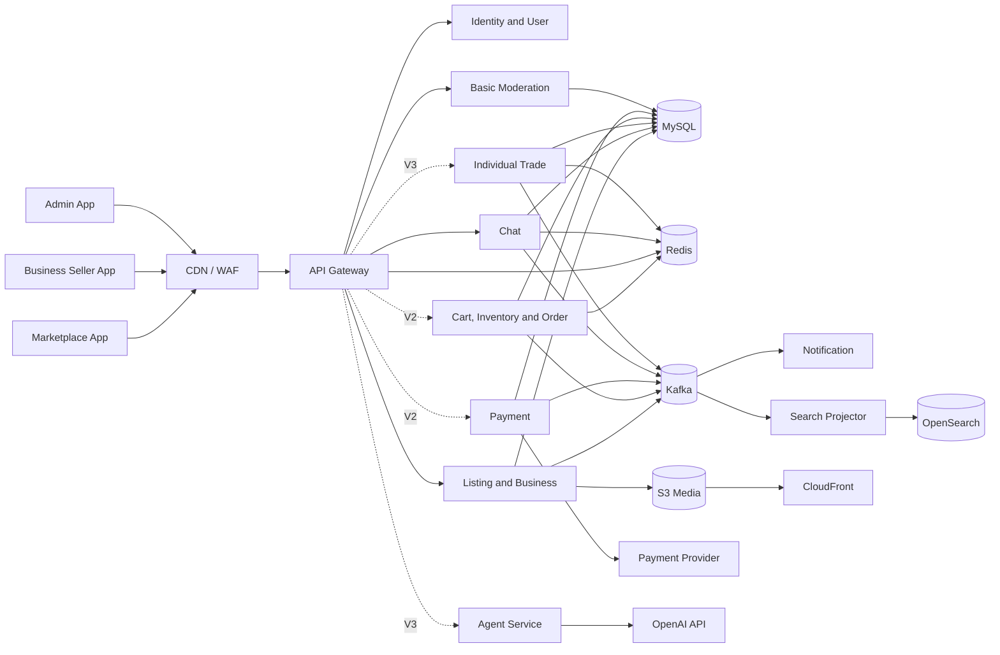
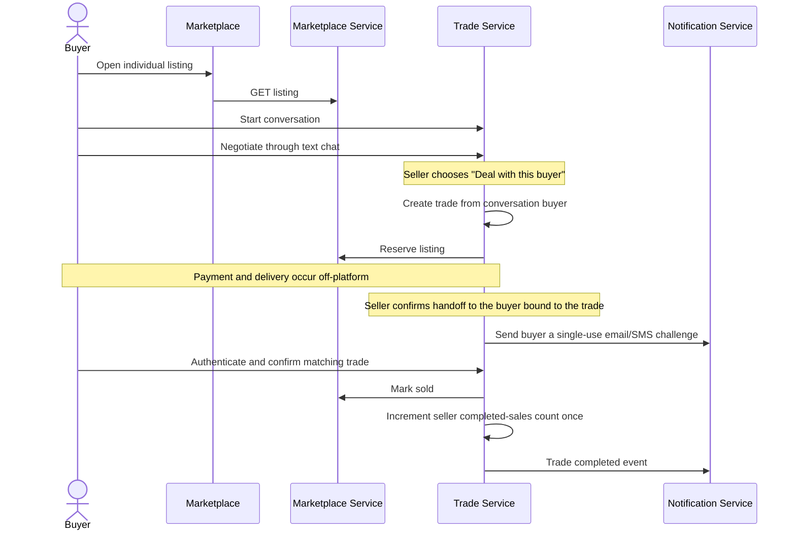
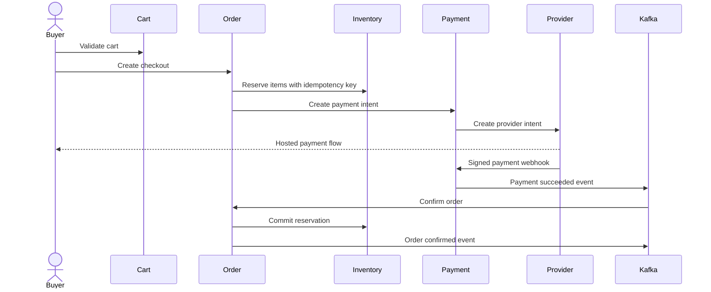
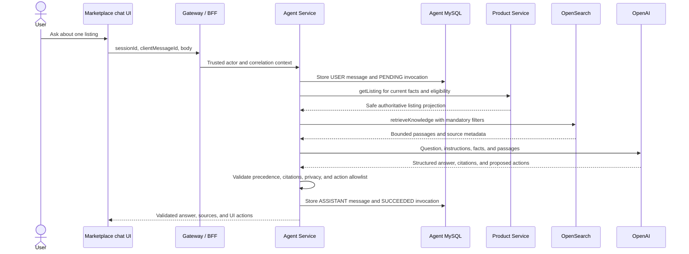

# Product Architecture

## 0. Release Boundary

Current MVP architecture includes:

- Gateway and identity/account foundation
- Individual/business seller and basic store profiles
- Listings, media, search, and public storefront
- Basic text chat
- Basic business/listing moderation

Deferred components:

- V2: cart, inventory, checkout/payment, orders/shipping, notifications
- V3: trade completion/reputation, reviews, advanced trust/admin, AI, analytics

Deferred components remain in this document as target architecture. They must
not be implemented during Phase 1 setup.

## 1. Architectural Principles

1. Individual trades and business orders are separate domain workflows.
2. One human has one identity; roles and business memberships grant access.
3. MySQL is the default transactional database for new MVP business data.
4. Redis stores short-lived and high-frequency state, not authoritative orders.
5. Kafka carries domain events; synchronous APIs handle immediate commands and
   reads.
6. OpenSearch is a derived search index, never the source of truth.
7. AI uses controlled tools and cannot bypass normal authorization or business
   rules.
8. Start with deployable services already present in the repository and add a
   service only when ownership or scaling requires it.

## 2. Web Applications

Use an Angular workspace with three applications and shared libraries:

```text
frontend/
  apps/
    marketplace/
    seller-portal/
    admin-portal/
  libs/
    auth/
    api-client/
    models/
    ui/
    validation/
    observability/
```

Target hosts:

```text
www.example.com       marketplace
seller.example.com    business seller portal
admin.example.com     admin portal
api.example.com       API gateway
```

The admin portal is separately deployed, protected by stricter access policy,
and never linked from public navigation.

MVP application responsibilities:

| Application | MVP responsibility | Deferred |
|---|---|---|
| Marketplace user site | Guest browsing, search, listing detail, buyer account flows, individual seller profile/listing/chat flows | Business checkout, buyer orders, reviews, AI |
| Business seller portal | Business onboarding status, basic store profile, basic business listing management | Individual personal listing management, inventory, order management, fulfillment, payments, staff management, analytics |
| Admin portal | Business application review and listing moderation | Reports, disputes, suspensions, support operations, finance operations |

Guests must be able to browse approved public listings without authentication.
Authentication is required for profile management, selling, business portal
access, chat, and admin actions.

Individual seller tools live in the marketplace account experience, not in the
business seller portal. A user who is both an individual seller and a business
member may use both surfaces, but each surface only exposes the matching
workflow.

UI strategy:

| Application | UI style | Primary interaction pattern |
|---|---|---|
| Marketplace user site | Commerce marketplace UI inspired by familiar shopping experiences | Search, category browse, listing cards, listing detail, seller contact |
| Business seller portal | Merchant management dashboard | Forms, tables, listing/store status, operational task flows |
| Admin portal | Internal operations dashboard | Review queues, filters, decision forms, audit context |

The marketplace UI should feel like a shopping site. The seller and admin
portals should feel like management systems. Shared components are allowed,
but navigation, information density, and page layout should follow the user's
task context.

Detailed marketplace UI rules live in
`docs/mvp/ui/marketplace-ui-redesign.md`.

## 2.1 Shared Code Libraries

Use build-time libraries, not a runtime `common-service`.

Backend Maven modules:

```text
common/
  common-core/
  common-web/
  common-storage/
  common-testing/
```

Responsibilities:

| Module | Allowed content |
|---|---|
| `common-core` | Money/currency value types, time/ID utilities, pagination primitives |
| `common-web` | Error envelope, correlation-ID filters, API validation helpers |
| `common-storage` | Technical object-storage upload/read/verify/delete adapters shared by listing media and avatars |
| `common-testing` | Test fixtures, container helpers, API assertions |

Deferred modules:

- `common-security`: authenticated principal and reusable authorization interfaces
- `common-events`: event envelope, outbox interfaces, consumer deduplication primitives

`common-storage` must not own listing media or avatar business rules. Content
type policy, object-key ownership, profile/listing versioning, moderation, and
public URL rules remain in the owning service.

Frontend Angular libraries:

```text
frontend/libs/
  auth/
  api-client/
  models/
  ui/
  validation/
  observability/
```

Shared libraries must not contain:

- JPA entities or repositories
- Service-specific controllers or business services
- Listing, trade, inventory, payment, or order aggregates
- Database migrations
- Service-specific configuration values
- A generic client that permits direct access to another service's database

Each service imports only the modules it needs. Shared libraries are versioned
with the monorepo and tested independently. Environment values and secrets use
runtime configuration or AWS configuration services, not Java constants.

## 3. Logical System View



## 4. Initial Deployable Services

The repository already contains several services. MVP implementation should
evolve them incrementally instead of creating every logical domain as an
independent service on day one.

The shared Maven modules above are dependencies, not deployable services. A
runtime service is created only when it owns business data or behavior.

### 4.1 API Gateway

Existing module: `api-gateway`.

Responsibilities:

- External routing
- Token validation
- Coarse route authorization
- Request IDs
- Rate limiting
- Request size limits
- Circuit breakers for safe read operations

The gateway does not implement business authorization. Services must still
verify resource ownership and business membership.

### 4.2 Identity service

Existing module: `auth-service`.

Responsibilities:

- Registration, verification, login, refresh, logout
- User profile and role assignments
- Business membership claims or lookup
- Admin role assignments

Decision required before implementation: use one authentication design. The
current mixed custom-session, JWT, and Keycloak approach must be replaced by a
single documented OIDC/JWT flow.

### 4.3 Marketplace service

Evolution path: replace or evolve `product-service`.

Initial responsibilities:

- Individual seller profiles
- Business applications, businesses, memberships, and stores
- Categories
- Individual and business listings
- Listing images
- Listing moderation submission
- Search event publication
- Immutable approved public listing-knowledge versions, exact/export reads,
  and transactional listing-knowledge outbox publication

The marketplace service must expose public read paths for approved listings
and storefronts. These reads are safe for guests and must not expose draft,
rejected, suspended, or private seller data.

MySQL is the target source of truth. MongoDB may remain temporarily during
migration, but new MVP contracts must not depend on MongoDB-only behavior.

Split trigger:

- Business onboarding and listing traffic require independent scaling, or
- Separate teams own the domains, or
- Schema/release coupling becomes a measured delivery problem.

### 4.4 Chat service

New module when its first implementation roadmap slice begins.

Responsibilities:

- Individual listing conversations
- Messages
- Conversation participants
- Per-participant read state
- Cursor-paginated message history
- Safe participant display hydration or snapshots

MVP enables only `LISTING_BUYER_SELLER` conversations. Customer service,
business-admin support, admin direct messaging, AI agent sessions, reviews,
reports, and blocking require future domain-specific slices before they are
enabled.

Realtime delivery may use WebSocket/SSE later. HTTP remains the authoritative
command and history interface. Persistent state remains in MySQL. Redis may
coordinate connections and presence when realtime delivery is added.

### 4.5 Individual trade service (V3)

New module or chat-adjacent domain added after basic chat is validated.

Responsibilities:

- Seller selection of a buyer from a listing conversation
- Individual trade state
- Trade confirmations

Trade APIs derive the buyer from a conversation created by chat-service. They
must not accept replacement buyer IDs, email, phone, address, or payment
status from the seller.

### 4.6 Commerce services (V2)

Evolution path: reintroduce inventory/order modules from the archived V2
tutorial stubs only through the approved slices in
`docs/v2/commerce/v2-com-00-commerce-domain-plan.md`.

Initial deployment ownership:

- `inventory-service`: business inventory, movement ledger, and inventory
  reservation state.
- `order-service`: Redis-backed cart, checkout orchestration, buyer order
  state, business fulfillment groups, and shipment records.
- `payment-service`: provider payment, refund, and reconciliation state as
  described below.

These services form the V2 commerce boundary. They keep separate schemas and
use explicit orchestration, idempotent internal commands, transactional
outboxes, and deduplicated events. No service writes another service's tables.
Do not add a second catch-all commerce deployment or restore archived tutorial
contracts unchanged.

These capabilities are intentionally outside the MVP business seller portal.
MVP merchants manage business profile and basic listings only.

### 4.7 Payment service (V2)

Archived V2 tutorial stub: `payment-service`. It is not part of the active MVP
Maven build or CI validation.

Responsibilities:

- Payment intent creation
- Provider webhook verification
- Payment attempts and events
- Refund state
- Fee and payout projections
- Reconciliation input

The payment service never receives raw card data.

### 4.8 Notification service (V2)

`V2-NOT-01A` reconstructs the archived `notification-service` in place and
returns it to the Maven reactor and migration CI as a default-off V2 module.
The first boundary persists buyer `ORDER_CONFIRMED` in-app notifications from
strict direct/fake `order.confirmed` version-2 events. `V2-NOT-01B` adds a
default-off authenticated read API that resolves the active application user
through Auth Service `GET /api/v1/users/me` using only the relayed bearer and
correlation ID. `V2-NOT-01C` adds the default-off gateway boundary and buyer
account notification center over that read API. `V2-NOT-01D` adds a retryable
Order-outbox-to-Notification HTTP adapter for approved commerce events,
business-scoped seller projections, server-authoritative unread counts,
buyer/seller centers, and bounded runtime activation. Delivery occurs only
after the authoritative commerce transaction commits, so an unavailable
Notification Service cannot roll that transaction back. Kafka, WebSockets,
email, SMS, push, preferences, provider deliveries, and marketing remain
deferred.

Responsibilities:

- Consume notification-worthy events
- Store in-app notifications
- Send versioned email templates
- Honor preferences
- Retry and dead-letter failures

### 4.9 Moderation and support module

Initially implemented as a module with its own API and tables. It can be
deployed with marketplace administration until load or ownership justifies a
separate service.

Responsibilities:

- Moderation cases
- MVP: business and listing approval decisions
- V3: reports, suspensions, support cases, operations queue, and audit search

### 4.10 Agent service (V3)

Isolated Python 3.12 and FastAPI service. `AI-LLM-01` establishes its provider
boundary before product agents are enabled.

Responsibilities:

- Agent sessions
- Agent-owned MySQL persistence and retention
- Tool registry
- Tool authorization
- Prompt and output policy
- Hybrid-RAG orchestration
- Knowledge ingestion, embedding, retrieval, and invalidation
- Cost/rate limits
- AI audit records

The agent service calls public/internal application APIs. It receives no direct
credentials for another service. OpenAI access is wrapped by a provider adapter using the
official Python SDK and Responses API. Product-agent orchestration may use the
OpenAI Agents SDK after authenticated sessions and application tools are
implemented. The service can stay live while provider credentials are absent,
but it must report itself not ready for AI work and core marketplace traffic
must not depend on that readiness.

For listing customer service, the agent service owns a rebuildable OpenSearch
knowledge projection and exposes two orchestration boundaries:

- `getListing` calls Product Service for current authoritative listing facts
  and eligibility;
- `retrieveKnowledge` applies mandatory subject-listing, public visibility,
  source-type, language, effective-date, version, and invalidation filters to
  approved vector content.

Product Service owns listing facts, public listing text, and category guidance.
The moderation/support module owns versioned marketplace policy, safety
guidance, and public FAQs. Source owners expose versioned reads or events; the
agent service never reads their schemas directly. OpenAI receives only bounded
runtime instructions, the user question, and approved tool context. It receives
no application credentials and cannot call application services directly.

`AI-KNOW-01` defines the Product Service category-guidance owner as one
immutable source stream per category and language. Platform-admin commands
insert active versions or newer invalidation tombstones using optimistic
version checks. The source version and reference-only outbox event commit
together. Exact-version and watermark-stable export reads reuse the dedicated
Agent Service token; category deactivation invalidates all active guidance
languages, and reactivation never republishes old text automatically.

`AI-RAG-02A` implements the first Product Service source path for active
approved individual listings. Immutable source bodies contain only title,
approved description, public city/region, and decimal price/currency.
Exact-version and watermark-stable export reads require a distinct agent
service token. Reference-only listing events are written through the same
transaction as the listing version and source snapshot, then delivered by a
retryable outbox publisher.

`AI-RAG-02B` implements the matching Agent Service intake. A Python asyncio
Kafka consumer validates the reference-only event, atomically deduplicates and
enqueues it in the agent-owned MySQL schema, and commits the Kafka offset only
after that transaction succeeds. FastAPI startup validates but never migrates
the schema; an explicit Flyway deployment job owns forward migration.
Source/provider/OpenSearch calls do not run in the Kafka poll loop. Accepted
jobs remain pending until `AI-RAG-02C` supplies deterministic content
processing and indexing.

`AI-RAG-02D` makes that projection rebuildable without interrupting live
updates. An operator command moves the write alias to a compatible empty
generation, records a durable run, and pages the watermark-stable Product
Service export through the same sanitizer, chunker, and embedding builder.
While read and write aliases differ, every live upsert, invalidation, and
exact deletion targets both physical generations. The loader writes only the
new generation and rechecks monotonic source state after each write so a
concurrent update or tombstone cannot resurrect an older exported version.

Promotion is a separate run-bound operator action. It is blocked until the
export is complete, mappings and embedding identity match, source/document
counts reconcile, ingestion and deletion queues are drained, and Kafka
consumer-group lag is zero. Tombstones invalidate retrieval synchronously and
schedule exact physical cleanup in a leased retry queue. Rollback moves reads
only to the run's recorded prior generation; alias divergence keeps live
mirroring active.

`AI-RAG-03` implements the internal retriever against the promoted read alias
for `LISTING` sources only. Trusted runtime context supplies actor, subject
listing, current Product Service version, effective time, language, and
limits. OpenSearch receives mandatory public, exact-listing, exact-version,
language/fallback, effective-date, and non-invalidated filters; every hit is
validated against the same trusted context again before it can become model
context. Query, passage, top-k, candidates, and total context are bounded.
Policy, safety, FAQ, and category retrieval remains disabled until their
source-owner contracts exist.

## 5. Core Workflow Architecture

### 5.1 Individual trade completion (V3)



Consistency rule: selecting the conversation buyer, creating the trade, and
reserving the listing must behave as one business operation. Prefer a single
database transaction if the tables are temporarily co-located. If deployed
separately, use an orchestrated saga with a compensating trade cancellation.

Completion rule: seller initiation addresses the buyer identity already stored
on the trade. The API never accepts a replacement buyer email, phone, or user
ID. The seller sees only masked contact-channel metadata. A challenge is sent
to the buyer's verified account contact, but buyer authentication is still
required. Final trade completion, listing sale, and the seller's public
completed-sales increment must be idempotent and logically atomic.

### 5.2 Business purchase (V2)



Recovery rule: provider state is authoritative for whether money moved.
Reconciliation must repair payment success without an order. Browser redirects
are never authoritative.

### 5.3 Listing customer-service answer (V3)



Product Service is authoritative when structured facts conflict with vector
content. Effective marketplace policy and safety guidance override FAQ or
category guidance. Same-precedence conflicts produce uncertainty. A failed
dependency marks the invocation failed without creating a duplicate assistant
message, and `clientMessageId` deduplicates retries.

## 6. Data and Storage

### MySQL

Use separate logical schemas per service in production. Local development may
use one MySQL server with multiple schemas.

Required characteristics:

- InnoDB
- UTC timestamps
- `utf8mb4`
- Foreign keys within a service-owned schema
- Flyway migrations
- Read replicas only after measured need

### Redis

Use for:

- Carts
- Rate-limit counters
- Short-lived authorization/session data if required
- Idempotency response cache where appropriate
- Realtime chat coordination

Do not use Redis as the only store for:

- Orders
- Payments
- Trades
- Reviews
- Audit records

### Kafka

Use for durable domain events:

- Listing activated/updated/deactivated
- Chat and individual trade updates
- Payment succeeded/failed
- Order confirmed/cancelled/shipped/delivered
- Review published/removed
- Notification requests

Use the transactional outbox pattern. Consumers must deduplicate by event ID.

### OpenSearch

Contains denormalized active-listing projections. Rebuild must be possible from
MySQL and events. Search results are revalidated on listing detail and checkout.

V3 adds a logically separate, versioned agent knowledge index and alias. It
contains only approved public chunks from eligible listing descriptions and
attributes, marketplace policy, safety guidance, FAQs, and category guidance.
Every chunk includes source identity and version, content hash, visibility,
language, effective dates, indexing time, invalidation state, and subject
listing ID when applicable.

The knowledge index is owned by the agent service, is rebuildable from
authoritative source services and durable events, and never stores conversation
history, private contact data, exact locations, moderation evidence, internal
notes, credentials, storage internals, or media bytes. Listing eligibility is
rechecked through Product Service before an answer. Stale listing-version
chunks are discarded even if asynchronous deletion has not completed.

### S3 and CloudFront

Clients upload through signed URLs. Object keys are generated by the server.
Images pass metadata validation and scanning before public delivery.

## 7. API and Event Conventions

- External APIs use `/api/v1`.
- IDs are opaque UUID/ULID strings unless an existing provider supplies them.
- Commands that can charge money or change inventory require
  `Idempotency-Key`.
- Cursor pagination is used for unbounded collections.
- Money uses decimal amount plus ISO 4217 currency.
- Timestamps use ISO 8601 UTC.
- Errors use the contract in `api-contract.md`.
- Events include event ID, event type, version, occurred time, correlation ID,
  producer, and payload.

## 8. Security Architecture

Authentication:

- One OIDC/JWT-compatible identity flow
- Short-lived access token
- Rotating refresh session
- Stronger policy and MFA for admin users

Authorization:

- Gateway validates token
- Service checks permission
- Service checks resource ownership or `business_id`
- Admin service checks granular platform role

External integrations:

- Verify webhook signatures
- Store provider event IDs for replay protection
- Use Secrets Manager in AWS
- Use private networking for databases and brokers

AI:

- Allowlisted tools only
- Tool arguments validated against schema
- User/business/admin context propagated
- Write actions require explicit user confirmation
- V3 support tools begin read-only
- Full prompt/tool/result audit with sensitive-data redaction

## 9. Scalability Path

The 100,000-user target is addressed through measured horizontal scaling:

1. Keep HTTP services stateless.
2. Put static applications and images behind CDN.
3. Use connection pooling and indexed queries.
4. Cache categories and safe public reads.
5. Use cursor pagination.
6. Partition Kafka topics by stable aggregate key.
7. Autoscale on latency, CPU, queue lag, and active connections.
8. Scale search, chat realtime nodes, and checkout independently.

Do not add database sharding before load tests show it is required.

## 10. Failure Behavior

| Dependency failure | Required behavior |
|---|---|
| OpenSearch unavailable | Detail pages remain available; search reports temporary failure; listing customer service degrades to fully grounded current facts or reports temporary AI unavailability |
| Redis cart unavailable | Existing orders unaffected; cart reports temporary failure |
| Kafka unavailable | Transaction commits with outbox; publisher retries; excessive knowledge-index lag disables affected vector-backed answers |
| Email provider unavailable | In-app notification persists; email retries |
| OpenAI unavailable | Core flows continue without AI |
| Payment provider timeout | Payment stays pending; reconciliation resolves it |
| Shipping provider unavailable | Shipment can be stored pending provider update |

## 11. Deployment

Production target preference:

- AWS CloudFront and WAF
- Application Load Balancer
- ECS/Fargate for services
- RDS MySQL Multi-AZ
- ElastiCache Redis
- Managed Kafka or a deliberately managed alternative
- OpenSearch Service
- S3
- Secrets Manager
- OpenTelemetry-compatible tracing and CloudWatch/managed metrics

Kubernetes is not required for the planned releases.

## 12. Architecture Decisions Still Required

Resolve before related implementation:

1. Identity provider: managed OIDC provider or corrected internal auth service.
2. V2 payment provider supporting business marketplace payouts.
3. V2 shipping provider or manual tracking.
4. Managed Kafka versus existing Kafka deployment.
5. Realtime chat transport: WebSocket or SSE plus HTTP commands.

These choices may change adapters, not the domain contracts in this document.

## V2-RET-01 return ownership addendum

Post-delivery returns are a dedicated Order Service business-group aggregate,
not cancellation state. Inventory Service owns group-scoped return movements;
Payment Service extends its deterministic refund adapter for immutable group
merchandise refunds; Notification Service consumes committed return outbox
events. Each service writes only its schema and all capabilities remain
default-off outside the bounded commerce runtime.
