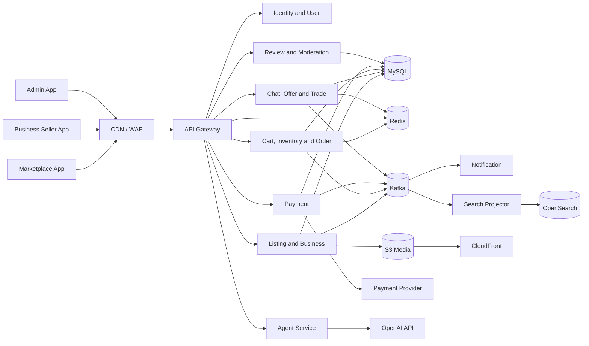
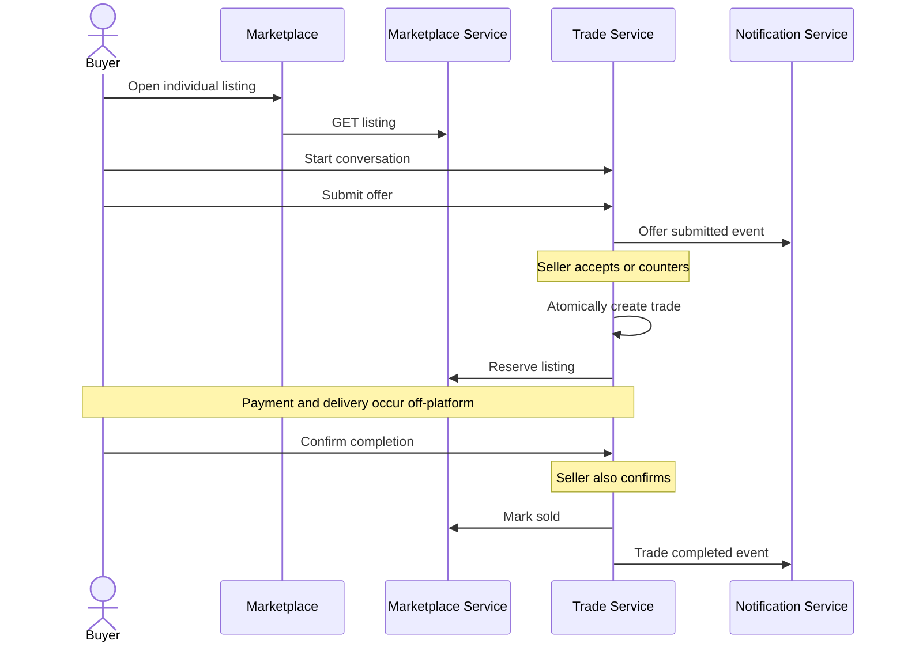
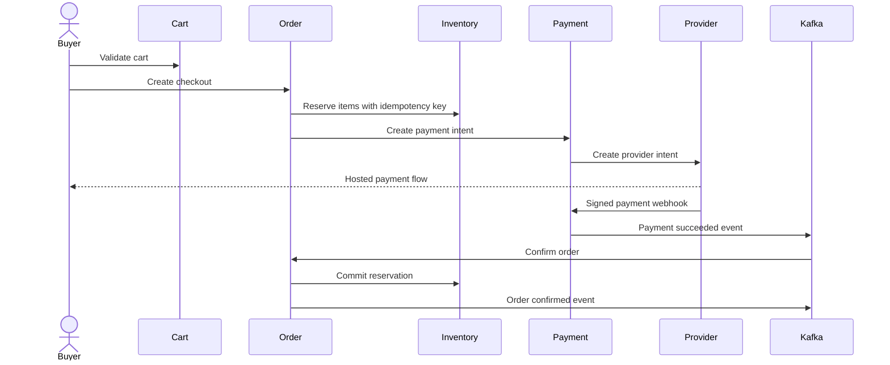

# MVP Architecture

## 1. Architectural Principles

1. Individual trades and business orders are separate domain workflows.
2. One human has one identity; roles and business memberships grant access.
3. MySQL is the default transactional database for new MVP business data.
4. Redis stores short-lived and high-frequency state, not authoritative orders.
5. Kafka carries domain events; synchronous APIs handle immediate commands and
   reads.
6. OpenSearch is a derived search index, never the source of truth.
7. AI uses controlled tools and cannot bypass normal authorization or business
   rules.
8. Start with deployable services already present in the repository and add a
   service only when ownership or scaling requires it.

## 2. Web Applications

Use an Angular workspace with three applications and shared libraries:

```text
frontend/
  apps/
    marketplace/
    seller-portal/
    admin-portal/
  libs/
    auth/
    api-client/
    models/
    ui/
    validation/
    observability/
```

Target hosts:

```text
www.example.com       marketplace
seller.example.com    business seller portal
admin.example.com     admin portal
api.example.com       API gateway
```

The admin portal is separately deployed, protected by stricter access policy,
and never linked from public navigation.

## 3. Logical System View



## 4. Initial Deployable Services

The repository already contains several services. MVP implementation should
evolve them incrementally instead of creating every logical domain as an
independent service on day one.

### 4.1 API Gateway

Existing module: `api-gateway`.

Responsibilities:

- External routing
- Token validation
- Coarse route authorization
- Request IDs
- Rate limiting
- Request size limits
- Circuit breakers for safe read operations

The gateway does not implement business authorization. Services must still
verify resource ownership and business membership.

### 4.2 Identity service

Existing module: `auth-service`.

Responsibilities:

- Registration, verification, login, refresh, logout
- User profile and role assignments
- Business membership claims or lookup
- Admin role assignments

Decision required before implementation: use one authentication design. The
current mixed custom-session, JWT, and Keycloak approach must be replaced by a
single documented OIDC/JWT flow.

### 4.3 Marketplace service

Evolution path: replace or evolve `product-service`.

Initial responsibilities:

- Individual seller profiles
- Business applications, businesses, memberships, and stores
- Categories
- Individual and business listings
- Listing images
- Listing moderation submission
- Search event publication

MySQL is the target source of truth. MongoDB may remain temporarily during
migration, but new MVP contracts must not depend on MongoDB-only behavior.

Split trigger:

- Business onboarding and listing traffic require independent scaling, or
- Separate teams own the domains, or
- Schema/release coupling becomes a measured delivery problem.

### 4.4 Trade service

New module when its first roadmap slice begins.

Responsibilities:

- Individual listing conversations
- Messages
- Offers and counters
- Individual trade state
- Trade confirmations

Realtime delivery may use WebSocket/SSE. Persistent state remains in MySQL.
Redis may coordinate connections and presence.

### 4.5 Commerce service

Evolution path: coordinate `inventory-service` and `order-service`.

Responsibilities:

- Redis-backed cart
- Business inventory
- Inventory reservations
- Checkout sessions
- Business order state
- Fulfillment groups
- Shipment records

Inventory ownership remains in `inventory-service`. Order state remains in
`order-service`. Cross-service flow uses explicit orchestration and idempotent
commands; no service writes another service's tables.

### 4.6 Payment service

Existing module: `payment-service`.

Responsibilities:

- Payment intent creation
- Provider webhook verification
- Payment attempts and events
- Refund state
- Fee and payout projections
- Reconciliation input

The payment service never receives raw card data.

### 4.7 Notification service

Existing module: `notification-service`.

Responsibilities:

- Consume notification-worthy events
- Store in-app notifications
- Send versioned email templates
- Honor preferences
- Retry and dead-letter failures

### 4.8 Moderation and support module

Initially implemented as a module with its own API and tables. It can be
deployed with marketplace administration until load or ownership justifies a
separate service.

Responsibilities:

- Moderation cases
- Reports
- Account/business suspensions
- Support cases
- Operations queue
- Audit search

### 4.9 Agent service

New isolated service added after underlying APIs are stable.

Responsibilities:

- Agent sessions
- Tool registry
- Tool authorization
- Prompt and output policy
- Cost/rate limits
- AI audit records

The agent service calls public/internal application APIs. It receives no direct
database credentials.

## 5. Core Workflow Architecture

### 5.1 Individual trade



Consistency rule: accepted offer, trade creation, and listing reservation must
behave as one business operation. Prefer a single database transaction if the
tables are temporarily co-located. If deployed separately, use an orchestrated
saga with a compensating trade cancellation.

### 5.2 Business purchase



Recovery rule: provider state is authoritative for whether money moved.
Reconciliation must repair payment success without an order. Browser redirects
are never authoritative.

## 6. Data and Storage

### MySQL

Use separate logical schemas per service in production. Local development may
use one MySQL server with multiple schemas.

Required characteristics:

- InnoDB
- UTC timestamps
- `utf8mb4`
- Foreign keys within a service-owned schema
- Flyway migrations
- Read replicas only after measured need

### Redis

Use for:

- Carts
- Rate-limit counters
- Short-lived authorization/session data if required
- Idempotency response cache where appropriate
- Realtime chat coordination

Do not use Redis as the only store for:

- Orders
- Payments
- Trades
- Reviews
- Audit records

### Kafka

Use for durable domain events:

- Listing activated/updated/deactivated
- Offer and trade updates
- Payment succeeded/failed
- Order confirmed/cancelled/shipped/delivered
- Review published/removed
- Notification requests

Use the transactional outbox pattern. Consumers must deduplicate by event ID.

### OpenSearch

Contains denormalized active-listing projections. Rebuild must be possible from
MySQL and events. Search results are revalidated on listing detail and checkout.

### S3 and CloudFront

Clients upload through signed URLs. Object keys are generated by the server.
Images pass metadata validation and scanning before public delivery.

## 7. API and Event Conventions

- External APIs use `/api/v1`.
- IDs are opaque UUID/ULID strings unless an existing provider supplies them.
- Commands that can charge money or change inventory require
  `Idempotency-Key`.
- Cursor pagination is used for unbounded collections.
- Money uses decimal amount plus ISO 4217 currency.
- Timestamps use ISO 8601 UTC.
- Errors use the contract in `api-contract.md`.
- Events include event ID, event type, version, occurred time, correlation ID,
  producer, and payload.

## 8. Security Architecture

Authentication:

- One OIDC/JWT-compatible identity flow
- Short-lived access token
- Rotating refresh session
- Stronger policy and MFA for admin users

Authorization:

- Gateway validates token
- Service checks permission
- Service checks resource ownership or `business_id`
- Admin service checks granular platform role

External integrations:

- Verify webhook signatures
- Store provider event IDs for replay protection
- Use Secrets Manager in AWS
- Use private networking for databases and brokers

AI:

- Allowlisted tools only
- Tool arguments validated against schema
- User/business/admin context propagated
- Write actions require explicit user confirmation
- MVP support tools are read-only
- Full prompt/tool/result audit with sensitive-data redaction

## 9. Scalability Path

The 100,000-user target is addressed through measured horizontal scaling:

1. Keep HTTP services stateless.
2. Put static applications and images behind CDN.
3. Use connection pooling and indexed queries.
4. Cache categories and safe public reads.
5. Use cursor pagination.
6. Partition Kafka topics by stable aggregate key.
7. Autoscale on latency, CPU, queue lag, and active connections.
8. Scale search, chat realtime nodes, and checkout independently.

Do not add database sharding before load tests show it is required.

## 10. Failure Behavior

| Dependency failure | Required behavior |
|---|---|
| OpenSearch unavailable | Detail pages remain available; search reports temporary failure |
| Redis cart unavailable | Existing orders unaffected; cart reports temporary failure |
| Kafka unavailable | Transaction commits with outbox; publisher retries |
| Email provider unavailable | In-app notification persists; email retries |
| OpenAI unavailable | Core flows continue without AI |
| Payment provider timeout | Payment stays pending; reconciliation resolves it |
| Shipping provider unavailable | Shipment can be stored pending provider update |

## 11. Deployment

MVP production preference:

- AWS CloudFront and WAF
- Application Load Balancer
- ECS/Fargate for services
- RDS MySQL Multi-AZ
- ElastiCache Redis
- Managed Kafka or a deliberately managed alternative
- OpenSearch Service
- S3
- Secrets Manager
- OpenTelemetry-compatible tracing and CloudWatch/managed metrics

Kubernetes is not required for MVP.

## 12. Architecture Decisions Still Required

Resolve before related implementation:

1. Identity provider: managed OIDC provider or corrected internal auth service.
2. Payment provider supporting business marketplace payouts.
3. Shipping provider or manual tracking-only MVP.
4. Managed Kafka versus existing Kafka deployment.
5. Realtime chat transport: WebSocket or SSE plus HTTP commands.

These choices may change adapters, not the domain contracts in this document.
